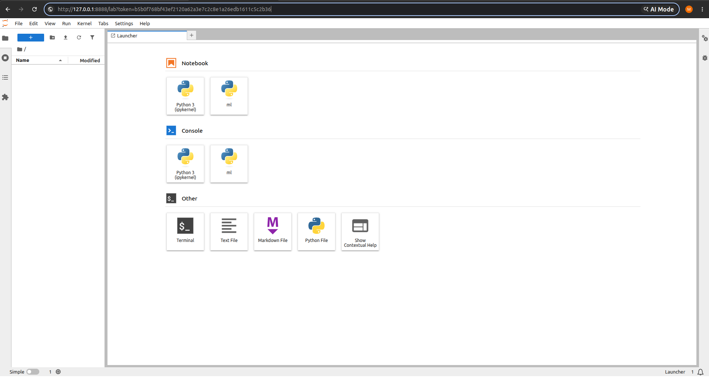
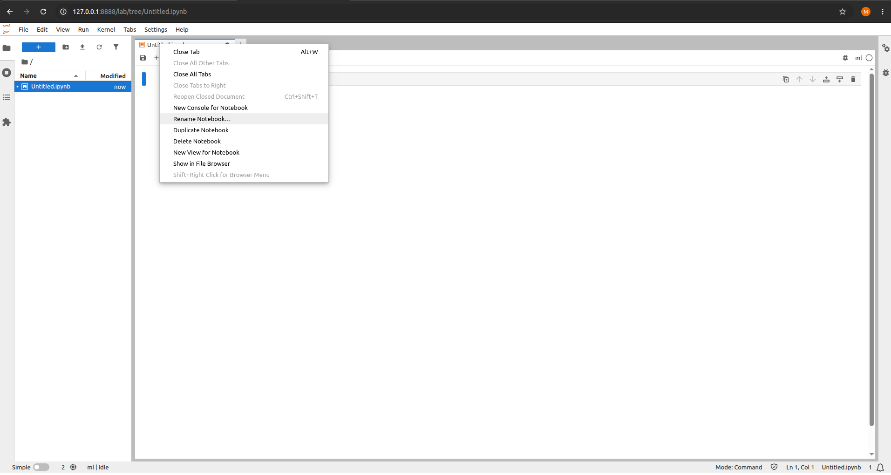
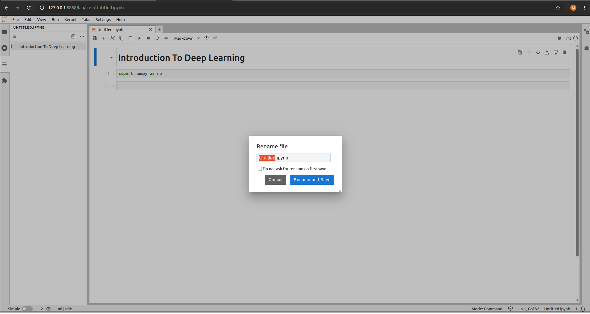

<p align="center">
  
</p>

<h1 align="center">Kedulab</h1>

<p align="center">
  <em>GPU-accelerated JupyterLab containers — one image per project, side-by-side, reproducible. Adaptable to any project.</em>
</p>

<p align="center">
  <a href="https://keduka.com"></a>
  
  
  
  
</p>

---

## About Kedulab

**Kedulab** is a general-purpose Docker Compose setup for GPU-accelerated JupyterLab containers, each with its own pinned dependency set and its own host-mounted workspace. Built on `nvidia/cuda:12.4.1-cudnn-runtime-ubuntu22.04`, with [`uv`](https://docs.astral.sh/uv/) managing both Python (3.12 by default) and packages.

It is not tied to any one curriculum or organization — change a few env vars and you have a new stack for whatever you're working on. Spin up one notebook for one project. Spin up another for a different project, with completely different dependencies, side-by-side.

Kedulab is maintained by **Keduka Cognitive Services (KCS)** and powers the notebooks behind **[Keduka AI School (KAIS)](https://keduka.com)** — an AI-powered learning platform pairing every learner with adaptive AI teachers across data science, machine learning, NLP, computer vision, federated learning, physics, and mathematics. KAIS is one consumer of Kedulab; the project itself is built to be adopted by anyone who needs reproducible, GPU-backed JupyterLab environments.

---

## Prerequisites

- **Docker Engine 24+** with Compose v2 (`docker compose`, not `docker-compose`).
- **NVIDIA GPU + driver** on the host — *recommended* for real ML throughput, but **not required** (see CPU fallback below).
- **[NVIDIA Container Toolkit](https://docs.nvidia.com/datacenter/cloud-native/container-toolkit/install-guide.html)** so containers can see the GPU. Verify with:

  ```bash
  docker run --rm --gpus all nvidia/cuda:12.4.1-base-ubuntu22.04 nvidia-smi
  ```

  If that prints a GPU table, you're good.

### CPU fallback

No GPU? The stack still runs. The same CUDA-based image works on a CPU-only host — TensorFlow, PyTorch, and JAX simply fall back to CPU at runtime (slower, but fully functional). The installer probes for a GPU and, when it finds none, **informs you and defaults to CPU** by pinning `COMPOSE_FILE=docker-compose.cpu.yml` in `.env` (the CPU compose file is `docker-compose.yml` minus the GPU device reservation). To select it manually:

```bash
COMPOSE_FILE=docker-compose.cpu.yml docker compose -p <project> up -d --build
```

Force the installer's choice with `KEDULAB_GPU=on` or `KEDULAB_GPU=off` (default: `auto`). To switch a CPU stack back to GPU later, install the NVIDIA Container Toolkit and remove the `COMPOSE_FILE` line from `.env`.

---

## Quick start

### Recommended: one-liner installer

```bash
curl -fsSL https://raw.githubusercontent.com/keduka-ai/kedulab/main/install.sh | bash
```

The installer is a thin bash bootstrap — it verifies your host can run the stack (Docker, Compose v2), probes for a GPU (falling back to CPU and pinning `docker-compose.cpu.yml` if none is found), clones the repo, walks you through the per-stack env vars (project name, requirements file, mount path, host port — press enter for defaults), writes `.env`, and prints the exact `docker compose` command to start the container. It does **not** auto-launch — you run the final command yourself.

Read it first if you'd like:

```bash
curl -fsSL https://raw.githubusercontent.com/keduka-ai/kedulab/main/install.sh | bash -s -- --help
```

Flags: `--ref <tag>` (pin to a version), `--dir <path>` (custom clone target), `--yes` (accept all defaults), `--no-prereq-check` (CI mode). Env-var overrides: `KEDULAB_PROJECT`, `KEDULAB_REQUIREMENTS_FILE`, `KEDULAB_MOUNT_PATH`, `KEDULAB_HOST_PORT`.

### Manual install

```bash
git clone https://github.com/keduka-ai-ai/kedulab.git
cd kedulab

# Build and launch the default stack
docker compose up -d --build

# Tail logs and grab the Jupyter URL/token
docker compose logs -f jupyter
```

Open the URL printed in the logs (something like `http://127.0.0.1:5678/lab?token=...`) in your browser.

The `./workspace` directory on the host is mounted at `/home/workspace` inside the container, which is JupyterLab's working directory. Anything you save in JupyterLab lands there.

Stop:

```bash
docker compose down
```

---

## First run

Once the stack is up and you've opened the Jupyter URL, here's what to expect.

The Launcher shows both the stock `Python 3 (ipykernel)` and the project's named `ml` kernel. The `ml` kernel is what the Dockerfile registers from the active `${REQUIREMENTS_FILE}` (via `ipykernel install --sys-prefix --name ml`); the bare `Python 3 (ipykernel)` is the default that ships with the base venv.

<p align="center">
  
</p>

Right-click a notebook tab to rename it — `Untitled.ipynb` becomes whatever you want.

<p align="center">
  
</p>

The rename writes through to the host-mounted workspace, so the file appears in `./workspace/` (or your configured `MOUNT_PATH`) on the host immediately.

<p align="center">
  
</p>

---

## Configuration

All knobs have defaults, all are overridable per-stack.

| Variable | Default | What it does |
| --- | --- | --- |
| `REQUIREMENTS_FILE` | `requirements.txt` | Which deps file gets baked into the image. Use `requirements-distributed.txt` to add Ray/Kubernetes/KFP. |
| `PYTHON_VERSION` | `3.12` | Python version uv installs into the venv. |
| `MOUNT_PATH` | `./workspace` | Host directory mounted at `/home/workspace`. |
| `HOST_PORT` | `8888` | Host port mapped to JupyterLab. Must be unique across running stacks. |
| `BIND_ADDR` | `127.0.0.1` | Host interface to bind on. Loopback by default — JupyterLab on a public bind is arbitrary code execution. Override to `0.0.0.0` **only** behind a real auth proxy, and set `JUPYTER_PASSWORD_HASH` (below) at the same time. |
| `MEMORY_LIMIT` | `16G` | Compose memory limit. |
| `CPU_LIMIT` | `8` | Compose CPU limit. |
| `SHM_SIZE` | `2gb` | `/dev/shm` size. Raise if PyTorch DataLoader workers crash with `worker is killed`. |
| `USER_UID` / `USER_GID` | `1000` / `1000` | UID/GID of the non-root `jovyan` user. Match to your host `id -u` / `id -g` so bind-mount files are owned correctly. |
| `UV_VERSION` | `0.5.11` | Tag of `ghcr.io/astral-sh/uv` the build copies the uv binary from. Bump to upgrade uv. |
| `JUPYTER_PASSWORD_HASH` | (empty) | When set, swaps auto-token auth for hashed-password auth at container start. **Required when `BIND_ADDR` is not `127.0.0.1`.** Generate: `python -c "from jupyter_server.auth import passwd; print(passwd())"`. |
| `PIP_AUDIT_STRICT` | `0` | Build arg — set to `1` in CI to run `pip-audit --strict` after the deps install. Off by default so local rebuilds aren't blocked on a single transitive CVE. |

There are two ways to override them.

### Inline (one-off)

```bash
REQUIREMENTS_FILE=requirements-nlp.txt \
MOUNT_PATH=./projects/nlp \
HOST_PORT=5679 \
  docker compose -p nlp up -d --build
```

### Env file (reusable per-project)

```bash
cp env.example .env.nlp
# edit .env.nlp to set REQUIREMENTS_FILE, MOUNT_PATH, HOST_PORT
docker compose --env-file .env.nlp -p nlp up -d --build
```

The `-p <name>` flag is **required** when running more than one stack. It namespaces image tags, container names, and networks so stacks don't collide.

---

## Running multiple stacks in parallel

The whole point of the setup. Two example projects with different dependency sets, side-by-side:

```bash
# Stack 1: NLP project, port 5679, mounted at ./projects/nlp
REQUIREMENTS_FILE=requirements-nlp.txt \
MOUNT_PATH=./projects/nlp \
HOST_PORT=5679 \
  docker compose -p nlp up -d --build

# Stack 2: Vision project, port 5680, mounted at ./projects/vision
REQUIREMENTS_FILE=requirements-vision.txt \
MOUNT_PATH=./projects/vision \
HOST_PORT=5680 \
  docker compose -p vision up -d --build
```

Both run concurrently. `docker compose -p nlp logs jupyter` and `docker compose -p vision logs jupyter` show their logs separately. `docker compose -p nlp down` stops only the NLP stack.

Inspect what's running:

```bash
docker compose ls          # all compose projects on this host
docker ps                  # all running containers
```

---

## Adding a new project

1. **Create a requirements file.** Copy `requirements.txt` to `requirements-<project>.txt` and edit it. Pin every dep with `>=X.Y,<Z.0` notation — never bare names, never `==`. **Don't include `jupyterlab` or `ipykernel`** — those are installed automatically from `jupyter-base.txt`, the file should hold project deps only.

2. **Decide on a mount path.** `./projects/<project>` works fine. Create the directory; Docker won't create host paths for bind mounts.

   ```bash
   mkdir -p ./projects/<project>
   ```

3. **Pick a unique host port.** `5679`, `5680`, etc.

4. **Optionally create a `.env.<project>` file** so you don't have to remember the values:

   ```bash
   cp env.example .env.<project>
   # edit
   ```

5. **Build and run:**

   ```bash
   docker compose --env-file .env.<project> -p <project> up -d --build
   ```

---

## Working with a running stack

```bash
# Get the Jupyter token / URL
docker compose -p <project> logs jupyter

# Open a shell inside the container
docker compose -p <project> exec jupyter bash

# Restart Jupyter (e.g. after editing a config file in the workspace)
docker compose -p <project> restart jupyter

# Stop and remove (volumes preserved on the host)
docker compose -p <project> down

# Stop, remove, and also drop the built image (next `up` rebuilds from scratch)
docker compose -p <project> down --rmi local
```

Editing your `requirements-<project>.txt`? You need to rebuild for the image to pick it up:

```bash
docker compose -p <project> up -d --build
```

Compose will not rebuild on its own when only build args change — pass `--build` explicitly.

For reproducible, hash-pinned installs, generate a lockfile on the host (requires uv installed locally) and point `REQUIREMENTS_FILE` at it:

```bash
scripts/lock.sh requirements.txt          # -> requirements.lock
REQUIREMENTS_FILE=requirements.lock docker compose -p <project> up -d --build
```

---

## File layout

```text
.
├── Dockerfile                       # Multi-stage: uv-bin, base, shell, jupyter targets.
├── docker-compose.yml               # Single parameterized `jupyter` service.
├── env.example                      # Template for per-project .env files.
├── jupyter-base.txt                 # Pinned jupyterlab + ipykernel. Always installed.
├── requirements.txt                 # Default project ML deps. Copy & customize per project.
├── requirements-distributed.txt     # Ray / Kubernetes / KFP add-on for distributed work.
├── pyproject.toml                   # Scaffold mirror of requirements*.txt for host-side uv workflows.
├── scripts/entrypoint.sh            # JupyterLab launcher — flips to password auth when set.
├── scripts/lock.sh                  # Generate uv-compiled lockfiles.
└── README.md                        # This file.
```

`requirements-<project>.txt` files for individual projects live alongside `requirements.txt`. A pre-made `requirements-distributed.txt` ships with the repo for Ray / Kubernetes / KFP workloads — use it via `REQUIREMENTS_FILE=requirements-distributed.txt`.

---

## What's in the default image

The default `requirements.txt` covers the common ML/NLP surface:

- Numeric: `numpy`, `pandas`, `scipy`, `scikit-learn`, `scikit-image`, `shapely`, `albumentations`, `imageio`, `opencv-python`, `pillow`
- Visualisation: `matplotlib`, `plotly`, `seaborn`
- Deep learning: `tensorflow` (2.18.x, against the base image's CUDA), `keras`, `transformers` (5.x), `datasets`, `tensorflow-datasets`
- LLM / RAG: `langchain`, `langchain-core`, `langchain-community`, `gradio`, `bertviz`
- Document / OCR: `pypdf`, `pdfplumber`, `pdf2image`, `pytesseract`, `unstructured.pytesseract`
- Audio / video: `soundfile`, `pyaudio`, `yt-dlp`
- NLP: `nltk`, `num2words`
- Web (for prototype APIs): the Django + DRF stack
- Cloud: `boto3`, `azure-storage-blob`, `azure-mgmt-storage`

Plus, from `jupyter-base.txt`: `jupyterlab`, `ipykernel`.

For multi-node training, `REQUIREMENTS_FILE=requirements-distributed.txt` adds `ray[data,train,tune,serve]`, `kubernetes`, and `kfp-*`.

All pinned with `>=X.Y,<Z.0` to allow patch/minor updates while blocking breaking major bumps. A few intentional ceilings:

- `tensorflow<2.19` (user intent — 2.20+ isn't tested against the base image)
- `numpy<2.2` (TF 2.18's actual support window)
- `Django<6.0`, `plotly<6.0`, `gradio<6.0`, `pandas<3.0` — held below their breaking major releases until consuming notebooks are verified against them

You can replace any of this in your per-project requirements files. The image is rebuilt from scratch per project (each `-p <name>` gets its own image tag), so there's no shared state to worry about.

---

## Security posture

Defaults are tuned for a single-user laptop. Important controls:

- **Loopback bind by default** (`BIND_ADDR=127.0.0.1`). JupyterLab on a public bind is arbitrary code execution; never override `BIND_ADDR` without also setting `JUPYTER_PASSWORD_HASH`.
- **Non-root user `jovyan`** runs the kernel. Match `USER_UID`/`USER_GID` to your host to keep bind-mount file ownership clean.
- **`cap_drop: [ALL]` + `no-new-privileges:true`** applied to the service.
- **`read_only: true` rootfs** with `tmpfs` for `/tmp`, `~/.jupyter`, `~/.local`, `~/.cache`, `~/.ipython`. The bind-mounted `/home/workspace` is the only persistent writable surface. A code-execution bug inside the container cannot persist a payload to the image rootfs.
- **Memory / CPU limits** prevent runaway notebooks OOMing the host.
- **uv is pinned** via `ghcr.io/astral-sh/uv:${UV_VERSION}` — no unverified `install.sh` fetch at build time.
- **Opt-in `pip-audit` build gate** via `PIP_AUDIT_STRICT=1` — flip on in CI to fail builds on flagged CVEs.

For shared hosts or any deployment with `BIND_ADDR != 127.0.0.1`:

```bash
# Generate a password hash
python -c "from jupyter_server.auth import passwd; print(passwd())"
# Set it in .env.<project> as JUPYTER_PASSWORD_HASH, then bring the stack up.
```

The entrypoint switches JupyterLab from auto-token to hashed-password auth when `JUPYTER_PASSWORD_HASH` is set — no rebuild required.

---

## Troubleshooting

**`could not select device driver "" with capabilities: [[gpu]]`**
You're using the GPU compose file on a host with no working GPU — the NVIDIA Container Toolkit isn't installed or isn't configured for Docker. Either run the `nvidia-smi` smoke-test in the Prerequisites section to fix the toolkit, or switch to the CPU file: set `COMPOSE_FILE=docker-compose.cpu.yml` in `.env` (the installer does this automatically when it detects no GPU).

**Port already allocated**
Another stack (or another process) is on that port. Pick a different `HOST_PORT`.

**My new requirements aren't showing up**
Compose doesn't rebuild when build args change unless you tell it to. Run with `--build`. If that still doesn't pick up the change, force a clean rebuild:

```bash
docker compose -p <project> build --no-cache
docker compose -p <project> up -d
```

**Build is slow the first time**
The base CUDA image is ~3 GB and TensorFlow is another ~1.5 GB. First build downloads all of it. Subsequent builds reuse a BuildKit cache mount for `~/.cache/uv`, so editing `requirements.txt` no longer redownloads every wheel — typical iterative rebuild is under a minute.

**I want a CPU-only variant**
Use `docker-compose.cpu.yml` — it's `docker-compose.yml` minus the GPU device reservation, so the stack starts on a host with no GPU. Select it with `COMPOSE_FILE=docker-compose.cpu.yml docker compose -p <project> up -d --build` (the installer pins this in `.env` automatically when it finds no GPU). The same CUDA-based image is reused; TensorFlow / PyTorch / JAX fall back to CPU at runtime. If you want a *smaller* CPU image too, that's a bigger change — swap the base to a non-CUDA one (e.g. `python:3.12-slim`) and drop the CUDA wheel extras; at that point you've forked the project.

**Jupyter token rotates every restart**
Expected. JupyterLab generates a fresh token on each launch. Pull it from `docker compose -p <project> logs jupyter`. For a stable credential, set `JUPYTER_PASSWORD_HASH` in `.env.<project>` (see [Security posture](#security-posture)) — the entrypoint switches to hashed-password auth at runtime. Do **not** add `--ServerApp.token=<value>` by hand; use the entrypoint's password path instead.

**Container shows `(unhealthy)` in `docker ps`**
The HEALTHCHECK polls `http://localhost:5678/api/status` every 30s. A cold TF import can take a minute, so the first 60s is the start-period and won't flag. If it stays unhealthy after that, check `docker compose -p <project> logs jupyter` — the kernel manager may have wedged.

---

<p align="center">
  <sub>© Keduka Cognitive Services · <a href="https://keduka.com">keduka.com</a></sub>
</p>
